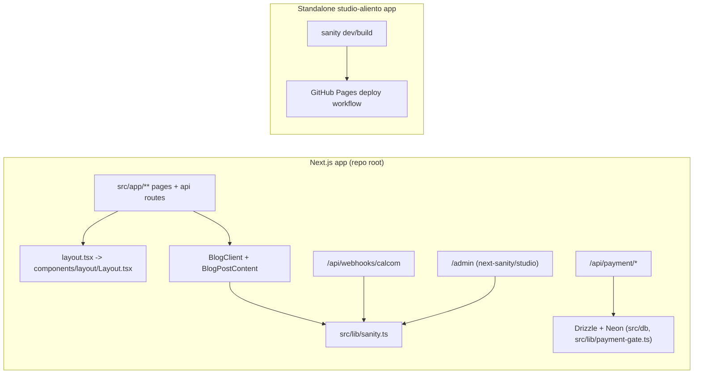
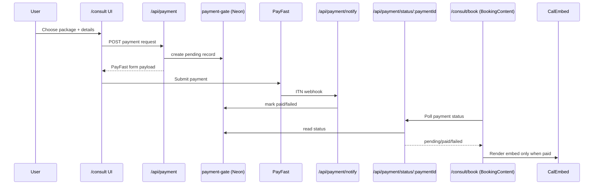

# Copilot Instructions for aliento-nextjs

## Build, lint, and test commands

### Main app (Next.js at repo root)
- Install: `npm install`
- Dev server: `npm run dev`
- Safe dev startup (checks/bootstraps before dev): `npm run dev:safe`
- Lint: `npm run lint`
- Production build: `npm run build`

### Studio app (`studio-aliento/`)
- Install: `cd studio-aliento && npm install`
- Dev server: `cd studio-aliento && npm run dev`
- Production build: `cd studio-aliento && npm run build`

### Tests
- There is currently no configured automated test runner (`npm test` / `npm run test` do not exist in either package), so there is no single-test command yet.

## High-level architecture

- This repo contains two related apps:
  1. A **Next.js App Router app** in the root (`src/app/**`) that serves the website, API routes, and an embedded Studio route at `/admin`.
  2. A **standalone Sanity Studio** in `studio-aliento/` used for separate studio builds/deploys (GitHub Pages workflow).

- The root app shell is composed in:
  - `src/app/layout.tsx` (global metadata + wrapper)
  - `src/components/layout/Layout.tsx` (Header/Footer around all pages)

- Blog/content rendering is Sanity-first with graceful fallbacks:
  - Data access: `src/lib/sanity.ts`
  - Listing pages: `src/app/health-topics/page.tsx` and `src/app/blog/page.tsx` (both can fall back to static in-repo content when CMS content is unavailable)
  - Detail pages: `src/app/health-topics/[slug]/page.tsx` and `src/app/blog/[slug]/page.tsx`
  - Reused UI: `src/app/blog/BlogClient.tsx`, `src/app/blog/[slug]/BlogPostContent.tsx`
  - Route canonicalization is configured in `next.config.ts` (`/blog` and `/blog/:slug` redirect to `/health-topics...`)

- Consult booking flow spans UI, payment, and webhook routes:
  - Checkout bootstrap: `src/app/api/payment/route.ts`
  - PayFast ITN status updates: `src/app/api/payment/notify/route.ts`
  - Booking gate polling endpoint: `src/app/api/payment/status/[paymentId]/route.ts`
  - Client-side gate + embed unlock: `src/app/consult/book/BookingContent.tsx`
  - Cal.com embed/webhook helpers: `src/components/integrations/CalEmbed.tsx`, `src/lib/calcom.ts`, `src/app/api/webhooks/calcom/route.ts`
  - Persistence: Drizzle + Neon (`src/db/schema.ts`, `src/db/index.ts`, `src/lib/payment-gate.ts`)

- Admin editing surfaces currently coexist:
  - Sanity Studio via `/admin` (`src/app/admin/[[...tool]]/page.tsx`, `sanity.config.ts`)
  - GitHub-backed MDX CRUD routes under `src/app/api/posts/**` (writes to `content/blog` in `LeroyAdonis/aliento-nextjs` on `main`)

### Architecture graph

### Consult booking/payment graph

## Key conventions for this repo

- TypeScript is strict (`tsconfig.json`) and imports should use the `@/*` alias for `src/*`.
- Keep server/client boundaries explicit:
  - Server Components by default in `src/app/**`
  - Add `'use client'` only where hooks/browser APIs are needed.
- Dynamic App Router params are commonly typed as promises and awaited (e.g., `{ params }: { params: Promise<{ slug: string }> }`).
- Preserve existing South African localization patterns in metadata and formatting (`en_ZA`, `toLocaleDateString('en-ZA', ...)`).
- Environment validation is fail-fast in core paths (notably `next.config.ts` and `src/lib/sanity.ts` via `zod`); do not bypass these checks when adding env-dependent features.
- UI styling follows existing Tailwind tokens/palette patterns from app styles and shared libs (`src/lib/design-system.ts`, `src/lib/theme.ts`).
